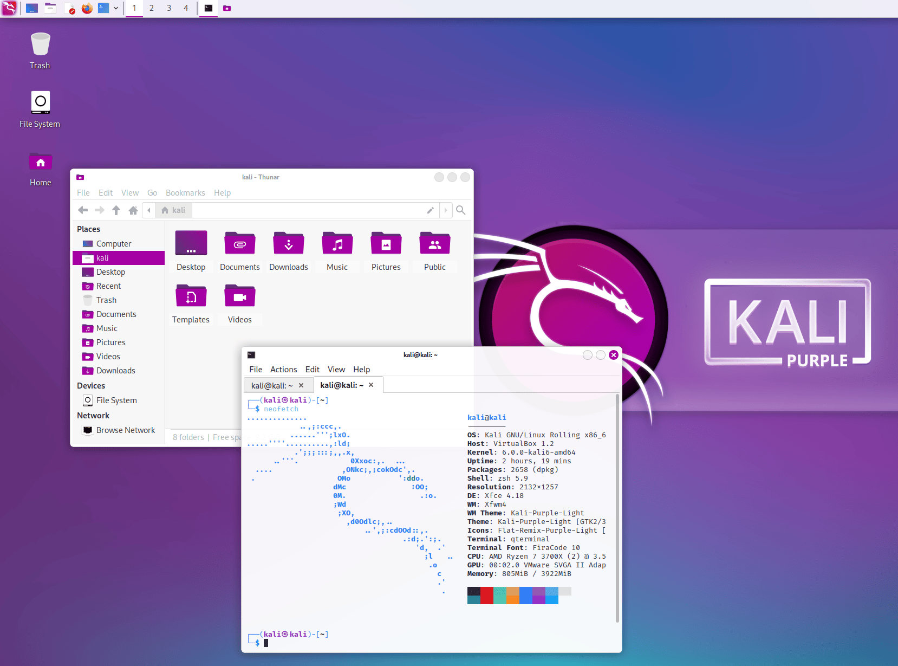
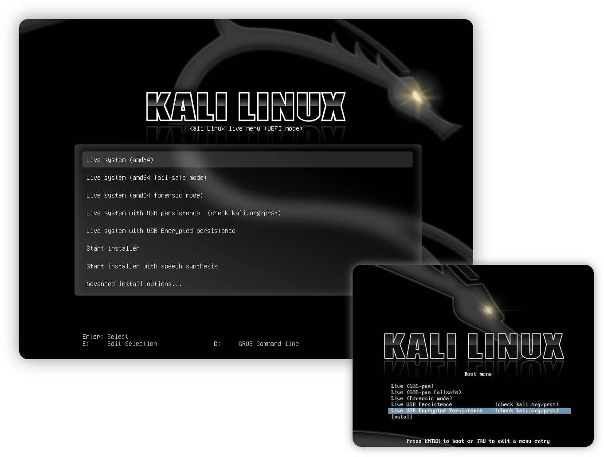
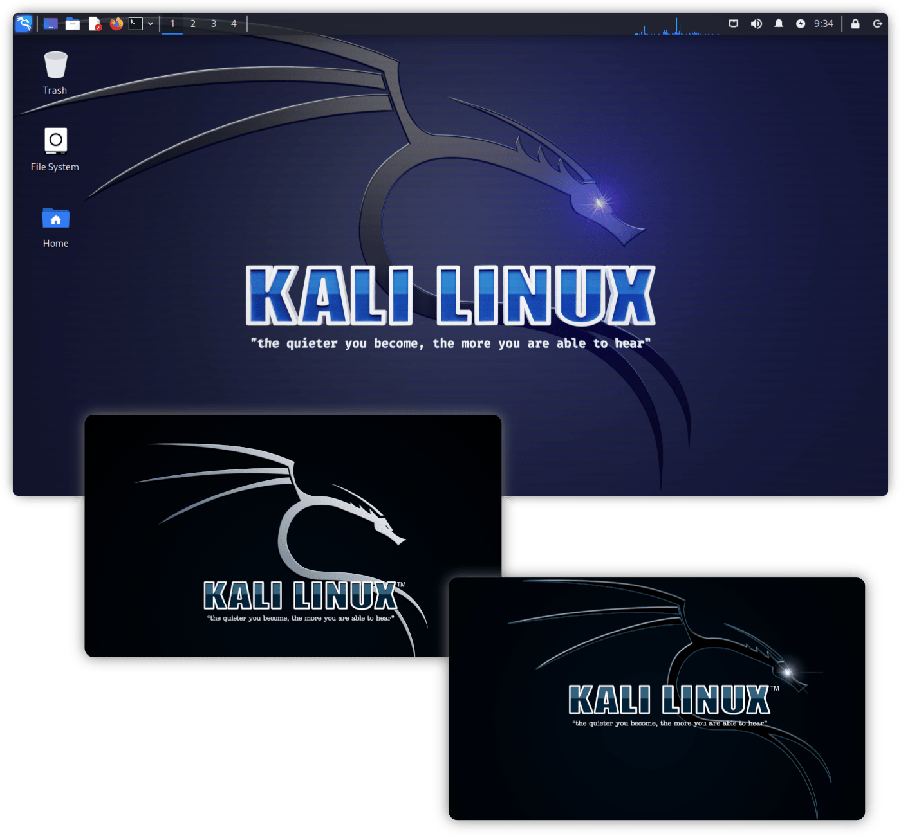
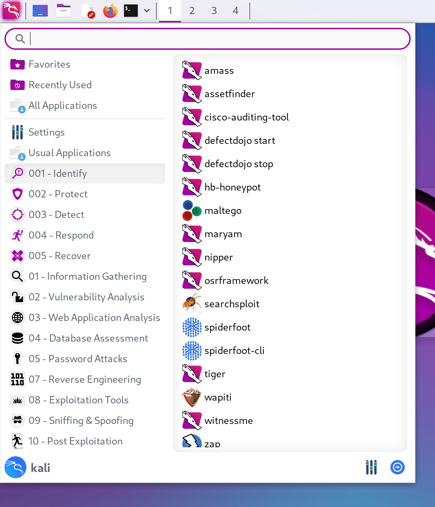

  

Offensive Security just launched Kali Linux 2023.1, the latest version of their popular hacking tool. to celebrate their 10th anniversary. Exciting news for the cybersecurity world! They've even added a special edition called Kali Purple, specifically designed for those on the defense side of cybersecurity. This version is perfect for Blue and Purple team members who want to strengthen their security strategies.

Kali Linux is a go-to choice for ethical hackers and security experts who want to test network systems for vulnerabilities and conduct cybersecurity research. With Python updates and other new features, this latest release promises to make cybersecurity even more accessible and effective.

- **[Kali Purple](#kali-purple-at-kali-linux-20231)** - The dawn of a new era. Kali is not only Offense, but starting to be defense
- **[Python Changes](#python-updates--changes)** - Python 3.11 & PIP changes going forward
- **[2023 Theme](#theme-refresh)** - Our once a year theme update! This time, what’s old is new again
- **[Desktop Updates](#)** - Xfce 4.18 & KDE Plasma 5.27
- **[Default Kernel Settings](#)** - What makes the Kali kernel different
- **[New Tools](#new-tools-in-kali)** - As always, various new tools added

## Kali Purple at Kali Linux 2023.1

Kali Purple is a new addition to Kali Linux 2023.1, designed for defensive security. It is specifically aimed at Blue and Purple team members, providing a comprehensive suite of tools for security professionals specializing in penetration testing and ethical hacking.

### What is in Kali Purple?

- Kali Purple is a reference architecture for the ultimate SOC In-A-Box
- It is perfect for learning, practicing SOC analysis and threat hunting, security control design and testing, Blue/Red/Purple teaming exercises, Kali spy vs. spy competitions, and protecting small to medium-sized environments
- It has over 100 defensive tools, including Arkime, CyberChef, Elastic Security, GVM, TheHive, Malcolm, Suricata, Zeek, and all the usual Kali tools
- It also has defensive tool documentation, a pre-generated image, and Kali Autopilot, an attack script builder/framework for automated attacks
- Kali Purple Hub is available for the community to share practice pcaps, Kali Autopilot scripts for blue teaming exercises, and community Wiki
- It has a defensive menu structure according to NIST CSF
    - **Identify**
    - **Protect**
    - **Detect**
    - **Respond**
    - **Recover**
- Kali Purple [Discord](https://discord.kali.org/) channels for community collaboration and fun
- It has a unique theme with installer, menu entries, and Xfce.

   
    
     

## Python Updates & Changes

Debian is getting ready to release its next stable version, which means packages are being updated. Python is one such package, with Python 3.11 now available in Debian. This new version brings more informative error tracebacks and a significant speed increase. However, some older packages may not be supported with the upgrade.

One change that may catch people off guard is Python's PIP behavior. Using PIP to install Python modules can clash with the operating system's package management system, apt. To avoid this issue, users have three options:

- Use `apt install python3-<package>` *(easy, simple & recommended)*
- Use `venv` *(slightly more complicated but still recommended)*
- Use `-break-system-packages` *(warning warning warning!)*

Kali Linux has applied a temporary patch to give users more time to adjust their procedures. However, this patch will be dropped with the release of Kali 2023.4 in the fourth quarter of this year. After that, PIP will refuse to install packages system-wide, and users will need to use one of the recommended options mentioned earlier. Kali Linux will remind users of this change with each version building up to the release. It is important to update scripts, pipelines, and documentation to the recommended ways to avoid issues with the new Python update.

## Theme Refresh

Kali Linux 2023.1 has a brand new theme with updated wallpapers for the desktop, login, and boot displays. The Kali purple flavor is also included, and all desktops are now supported with new purple themes and icons. This year, in celebration of the 10-year anniversary, the theme is inspired by previous iconic Kali releases. 

**the backgrounds pays tribute to previous iconic Kali releases**:

- Boot - **Kali 1.0**
- Login/Lock - **Kali 2.0**
- Wallpaper - **Kali 1.1**

Check out the latest Kali screenshot alongside the reference images below.

**Boot menu**:

**Login/Lock**:

**Desktop**:

**All new wallpapers**

## New Tools in Kali

It would not be a Kali release if there were not any new tools added! A quick run down of what has been added *(to the network repositories)*:

- [Arkime](https://pkg.kali.org/pkg/arkime)
- [CyberChef](https://pkg.kali.org/pkg/cyberchef)
- [DefectDojo](https://www.kali.org/tools/defectdojo/)
- [Dscan](https://www.kali.org/tools/dscan/)
- [Kubernetes-Helm](https://www.kali.org/tools/kubernetes-helm/)
- [PACK2](https://pkg.kali.org/pkg/pack2)
- [Redeye](https://www.kali.org/tools/redeye/)
- [Unicrypto](https://pkg.kali.org/pkg/unicrypto)

*There have also been numerous packages updates and new libraries as well. We also bump the Kali kernel to 6.1!*

  

## Download Kali Linux 2023.1

Kali Linux 2023.1 can be [downloaded](https://www.kali.org/get-kali/) or you can [update](https://www.kali.org/docs/general-use/updating-kali/) your existing installation to this version.

## My Thoughts

Kali Linux 2023.1 has made a great impression on me! What I really like is Kali Purple, a special edition designed for defensive security. Kali Purple comes with more than 100 tools that are perfect for practicing SOC analysis and threat hunting, as well as other things. This release also has some updates to Python and other elements that make it even better. The new theme is a nice touch and pays tribute to previous Kali versions that are well-known. Overall, I'm extremely happy with Kali Linux 2023.1